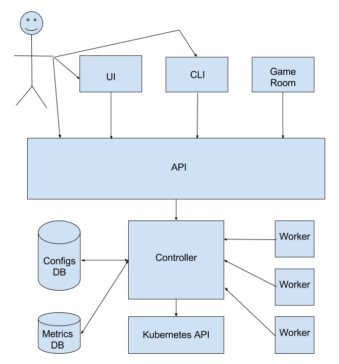

Maestro: Kubernetes Game Room Scheduler
=======================================

## Goal:

Have an unified system that automatically scales game rooms regardless of the protocol (TCP, UDP). This system is related to a matchmaker but does not handle the specificities of a match such as how many players fit in a room. It only deals with high level room occupation, i.e. is the room occupied or available. The rooms communicate directly with the matchmaker in order to register and unregister themselves from the matchmaking.

Let us define a Game Room Unity (GRU) as a Kubernetes service (type nodePort) associated with a single pod. This restriction is made because in AWS we cannot load balance UDP. We're using containerized applications and Kubernetes in order to simplify the management and scaling of the game rooms.

## Architecture:

Maestro is a game room scheduler that is composed by a controller, a watcher, an API and a CLI. In the future we may have an UI for displaying metrics such as:

- % of rooms usage
- rate of room occupation increase/decrease
- rooms cpu and memory usage
- etc.



### maestro-controller:

The controller is responsible for managing the Game Room Unities (GRUs). It creates and gracefully terminates GRUs according to auto scaling policies defined by the user. It makes use of the Kubernetes cluster's API endpoints in order to have updated information about the GRUs managed by Maestro. It is also responsible for persisting relevant information in the database and managing rooms statuses.

### maestro-watcher:

The watcher ensures that at any time the Game Room Unities (GRUs) state is as expected. If the scaling policies say that one should have 10 GRUs of a given type, the watcher will ask the controller to create or terminate GRUs as needed. The desired state is kept in a database that is consulted by the watcher (via controller) each time it runs. It has a lock so Maestro can be scaled horizontally. Each config (i.e. maestro scalable entity) has its own watcher.

### maestro-api:

The API is the connection of Maestro to the external world and with the game room itself. It is responsible for:

- Managing GRUs status and healthcheck (status are: creating, ready, occupied and terminating);
- Saving the scheduler config in a database that will be consulted by the watcher;
- Managing the pool of GRUs with each GRU host ip and port;

### maestro-cli:

The CLI is a wrapper for the maestro-api endpoints.

### maestro-client:

A client lib for Unity and cocos2dx responsible for calling maestro HTTP routes defined in the [room protocol](#room-protocol). It also must catch sigterm/sigkill and handle the room graceful shutdown.

## Configuring Maestro

The maestro binary receives a list of config files and spawn one maestro-controller for each config.

The config file must have the following information:

- Docker image
- Autoscaling policies
- Manifest yaml template
  1. Default configuration (ENV VARS)
  2. Ports and protocols (UDP, TCP)
  3. Resources requests (cpu and memory)


Example yaml config:

```yaml
name: pong-free-for-all    # this will be the name of the kubernetes namespace (it must be unique)
game: pong                 # several configs can refer to the same game
image: pong/pong:v123
ports:
  - containerPort: 5050    # port exposed in the container
    protocol: UDP          # supported protocols are TCP and UDP
  - containerPort: 8888
    protocol: TCP
limits:                    # these will be the resources limits applied to the pods created in kubernetes
  memory: "128Mi"          # they are used to decide how many rooms can run in each node
  cpu: "1"                 # more info: https://kubernetes.io/docs/tasks/configure-pod-container/assign-cpu-ram-container/
shutdownTimeout: 180       # duration in seconds the pod needs to terminate gracefully
autoscaling:
  min: 100                 # minimum amount of GRUs
  up:
    delta: 10              # how many GRUs will be created every time the scaling policy is triggered
    trigger:
      usage: 70            # minimum usage (percentage) that can trigger the scaling policy
      time: 600            # duration in seconds to wait before scaling policy takes place
    cooldown: 300          # duration in seconds to wait before consecutive scaling
  down:
    delta: 2               # how many GRUs will be terminated every time the scaling policy is triggered
    trigger:
      usage: 50            # maximum usage (percentage) the can trigger the scaling policy
      time: 900            
    cooldown: 300          
env:                       # environment variable to be passed on to the container
  - name: EXAMPLE_ENV_VAR
    value: examplevalue
  - name: ANOTHER_ENV_VAR
    value: anothervalue
cmd:                       # if the image can run with different arguments you can specify a cmd
  - "./room-binary"
  - "-serverType"
  - "6a8e136b-2dc1-417e-bbe8-0f0a2d2df431"
```

## TODOs:

- [x] Define Architecture
  - [x] Validate Kubernetes performance with a large amount of services
- [x] Formalize room protocol
- [x] Release map
- [x] Define config template

## Release Map:

- Milestone 1:

  Goals:
    - Create scheduler that scales up with the given policy.
    - Delete scheduler.

  Tasks:
  - [ ] maestro-controller
    - [x] scheduler
      - [x] create new scheduler with given config
        - [x] generate Kubernetes manifest template from the config
        - [x] create config in database
        - [x] create namespace in kubernetes
        - [x] create initial GRUs
          - [x] create service
          - [x] create pod with service nodePort as an argument
        - [x] delete scheduler
          - [x] remove config from database
          - [x] gracefully terminate running scheduler GRUs
          - [x] remove namespace from kubernetes
    - [x] scheduler state
      - [x] get rooms statuses
      - [x] update rooms status
      - [x] get autoscaling policy (from config persisted in db)
    - [x] scaling
      - [x] create GRUs
    - [ ] docs
  - [ ] maestro-watcher
    - [ ] validate rooms status vs autoscaling policy
    - [ ] scale cluster
      - [ ] up
    - [ ] docs
  - [ ] maestro-api
    - [x] scheduler
      - [x] create new scheduler with given config
      - [x] delete scheduler
    - [x] room protocol routes
      - [x] ping
      - [x] room ready
      - [x] match started
      - [x] match ended
    - [ ] docs
  - [ ] maestro-client
    - [ ] docs
    - [ ] configuration (maestro url / ping interval)
    - [ ] http client
    - [ ] polling to retrieve (host / port)
    - [ ] catch sigterm/sigkill and handle graceful shutdown
    - [ ] unity support

- Milestone 2:

  Goals:
    - Create scheduler that scales down with the given policy.
    - Update running scheduler.
    - Monitor scheduler rooms metrics.

  Tasks:
  - [ ] maestro-controller
    - [ ] scheduler
        - [ ] update running scheduler config
          - [ ] update Kubernetes manifest template with the new config
          - [ ] update config in database
          - [ ] update GRUs
            - [ ] launch new GRUs with the updates config
            - [ ] gracefully terminate GRUs running with old config
    - [ ] scheduler state
      - [ ] report room occupation metrics
    - [ ] scaling
      - [ ] remove GRUs
  - [ ] maestro-watcher
    - [ ] scale cluster
      - [ ] down
  - [ ] maestro-api
    - [ ] scheduler
      - [ ] update running scheduler config
    - [ ] room protocol routes
      - [ ] address polling
    - [ ] get rooms metrics
  - [ ] maestro-cli
    - [ ] scheduler
      - [ ] create new scheduler with given config
      - [ ] update running scheduler config
      - [ ] delete scheduler
    - [ ] docs
  - [ ] maestro-client
    - [ ] cocos2dx support
  - [ ] UI
    - [ ] display rooms metrics
    - [ ] scheduler
      - [ ] create new scheduler with given config
      - [ ] update running scheduler config
      - [ ] delete scheduler

## Doubts

- ~~Can Kubernetes handle thousands of services?~~
- How to manage different versions running at the same time? Will the matchmaker be responsible for it?
- How to properly tune autoscaling policies?

## Architecture Validation and Tests

### Validating Kubernetes performance

Testing with 30 nodes m4.large and 900 GRUs (pod + service) using a simple image for UDP listener: [mendhak/udp-listener:latest](https://hub.docker.com/r/mendhak/udp-listener/).

To be checked:

  - [x] Nodes CPU usage
  - [x] Master CPU usage
  - [x] Kube-System resources usage
  - [x] Kube-Proxy logs
  - [x] Load test
    - [x] What happens when a new service is created

#### Observations:

Initial setup: Kubernetes 1.5

- While running the 900 pods + services
  - kube-system used 30 cores (CPU) and 9Gi (memory usage). Each kube-proxy pod consumes about 1 core.
  - syncProxyRules took 16.810688ms

- Without any test pods
  - kube-system used 1 core (CPU) and 7Gi (memory usage). Each kube-proxy pod consumes about 0.02 core.
  - syncProxyRules took 966.091651ms (note: it runs by default every 1000ms)

Changing --iptables-min-sync-period to 10s seems to have improved the CPU usage performance, but the cost is that anytime a new service is created it can take up to 10s until they are available.

[This Kubernetes PR](https://github.com/kubernetes/kubernetes/pull/38996) might be related to the services scaling problem and it is available in Kubernetes 1.6 and greater.

After changing to Kubernetes 1.6 and running the 900 pods + services:

  - kube-system used 2 cores (CPU) and 2Gi (memory usage). Each kube-proxy pod consumes about 0.04 core.
  - syncProxyRules took 1.25s

kube-proxy relevant config options (to be tunned):

  - `--iptables-min-sync-period`
  - `--udp-timeout` (actually this flag is not used with iptables, in this case kube-proxy is using iptables default timeout: 30s)
  - `-proxy-port-range`


#### [Load Test](load-test/README.md)

## Room Protocol:

Game rooms have four different statuses:

  - Creating

    From the time maestro starts creating the GRU in Kubernetes until a room ready is received.

  - Ready

    From the time room ready is called until a match started is received. It means the room is available for matches.

  - Occupied

    From the time match started is called until a match ended is received. It means the room is not available for matches.

  - Terminating

    From the time a sigkill/sigterm signal is received by the room until the GRU is no longer available in Kubernetes.

Maestro's auto scaling policies are based on the number of rooms that are in ready state.


In order to properly set their statuses, game rooms must call the following maestro-api HTTP routes:

### Ping

  This route should be called every 10 seconds and serves as a keep alive sent by the GRU to Maestro.

#### Request:
  `PUT /schedulers/:schedulerName/rooms/:roomName/ping`

  ```
  {
    timestamp: <seconds since epoch>
  }
  ```

#### Response:
  ```
  {
    "success": <bool>
  }
  ```

### Address Polling

  This route should be polled by the GRU in order to obtain the room address (host ip and port).

#### Request:
  `GET  /schedulers/:schedulerName/rooms/:roomName/address`

#### Response:
  ```
  {
    "success": <bool>,
    "host": <host ip>,
    "port": <int>
  }
  ```

### Room ready

  This route should be called every time a room is ready to receive a match. You'll need to make sure it is only called after the room has its address.

#### Request:
  `PUT /schedulers/:schedulerName/rooms/:roomName/status`

  ```
  {
    timestamp: <seconds since epoch>,
    status: "room-ready"
  }
  ```

#### Response:
  ```
  {
    "success": <bool>
  }
  ```

### Match started

  This route should be called every time a match is started. It'll indicate that this GRU is occupied and is not available for new matches.

#### Request:
  `PUT /schedulers/:schedulerName/rooms/:roomName/status`

  ```
  {
    timestamp: <seconds since epoch>,
    status: "match-started"
  }
  ```

#### Response:
  ```
  {
    "success": <bool>
  }
  ```

### Match ended

  This route should be called every time a match is ended. It'll indicate that this GRU is no longer occupied and is available for new matches.

#### Request:
  `PUT /schedulers/:schedulerName/rooms/:roomName/status`

  ```
  {
    timestamp: <seconds since epoch>,
    status: "match-ended"
  }
  ```

#### Response:
  ```
  {
    "success": <bool>
  }
  ```

## Scheduler Management:

### Create

  This route creates a scheduler in Maestro using a provided YAML config.

#### Request:
  `POST /schedulers`

  ```
  {
    "yaml": <string>
  }
  ```

#### Response:
  ```
  {
    "success": <bool>
  }
  ```

### Delete

  This route deletes a scheduler in Maestro using the scheduler name.

#### Request:
  `DELETE /scheduler/:schedulerName`

#### Response:
  ```
  {
    "success": <bool>
  }
  ```
