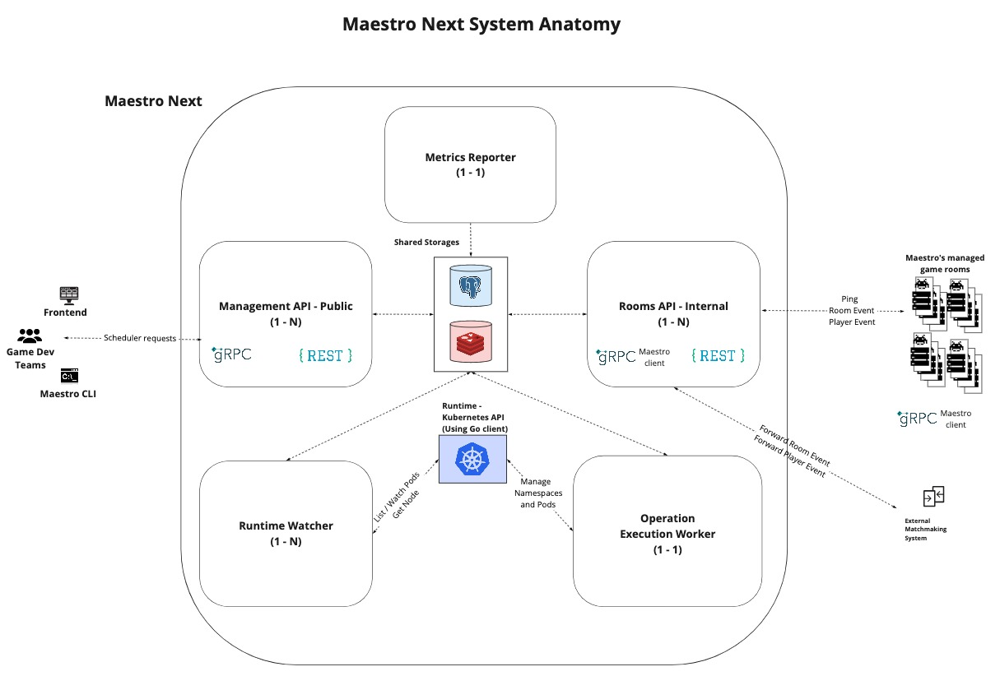
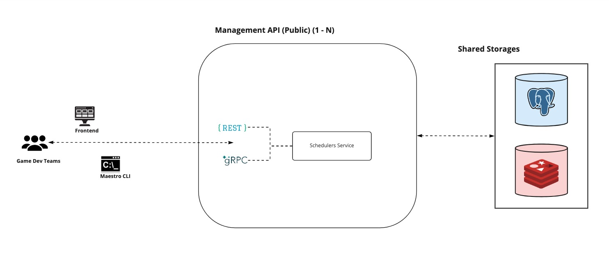
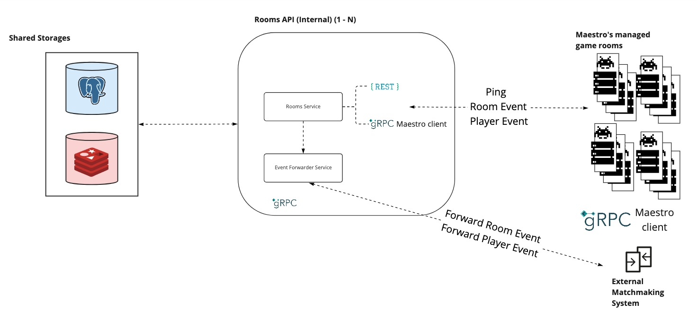
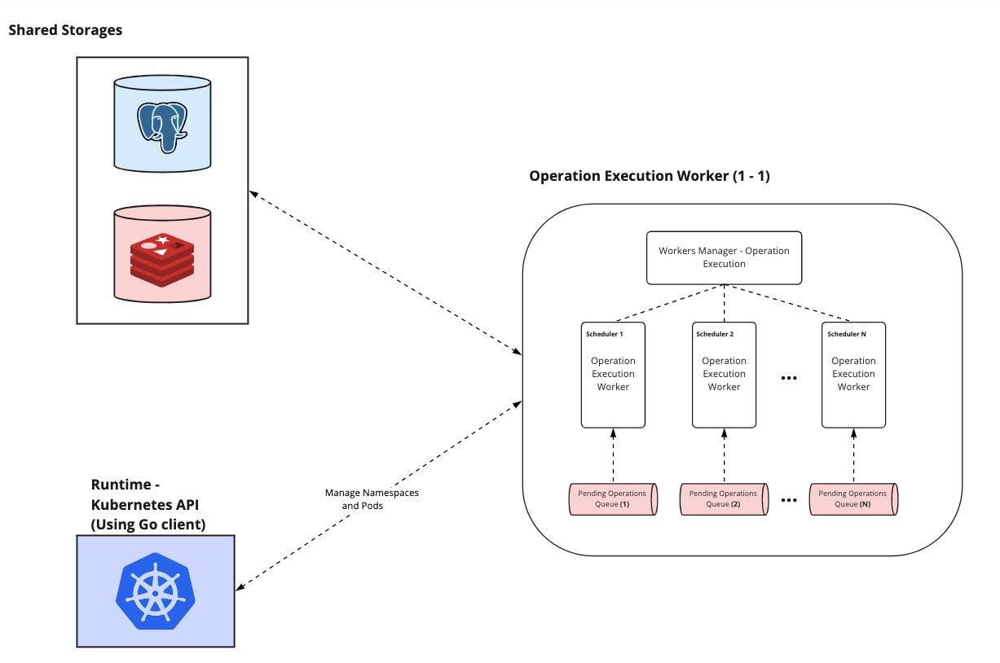
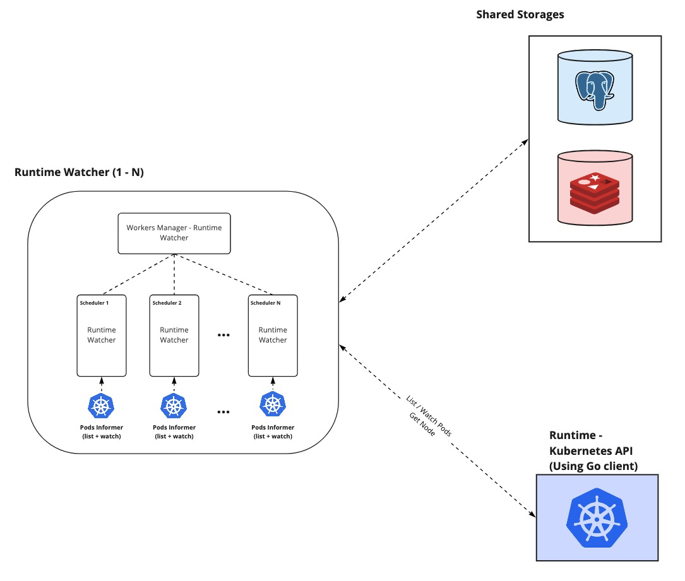
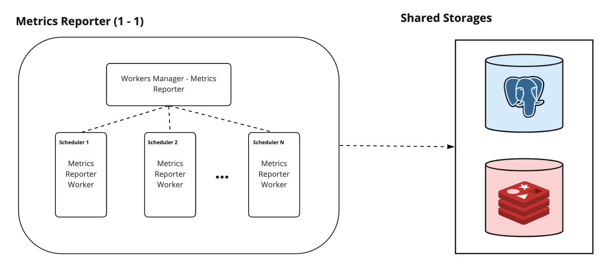

Maestro Next is a composition of different modules. Internally they are all part of the same code base but could be executed by giving the right arguments to the command line (or to your docker container entry point). E.g. `go run main.go start [MODULE_NAME]`

Maestro is composed of **Management API**, **Rooms API**, **Operation Execution Worker**, **Runtime Watcher Worker**, and **Metrics Reporter Worker.** 

Each module has its responsibilities and is divided apart in a way to avoid mixing the execution process. Each module was thought to avoid parallel problems and to give the client more visibility about which [**Operations**](Operations.md) are being executed and their respective status.

### Maestro modules

> ⚠ Note: Maestro currently only supports Kubernetes as Game Rooms runtime system. So Workers interact with them.

#### Management API

Management API is the module responsible for receiving user requests. It accepts gRPC and HTTP requests. It could be used to fetch a **Scheduler** status or else to execute a change in them. There is some different kind of routes. In the **Scheduler** creation, it simply adds a new entry in the Postgres (and the worker posteriorly creates a respective queue to it). In the fetch **Scheduler** routes, it fetches from Postgres the **Scheduler** information and in the Redis the **Operations**/game rooms information. And in the change routes, it creates **Operations** and enqueues them in the respective **Scheduler** queue in the Redis. Finally, fetch **Operation**/game rooms routes it fetches its information from Redis.

#### Rooms API

Rooms API is the module that receive requests from game rooms and executes according to which kind of request was done.

> ⚠ Note: The requests that Maestro receives in the Rooms API are documented in [this proto file](https://github.com/topfreegames/protos/blob/master/maestro/grpc/protobuf/events.proto).

#### Operation Execution Worker

> ⚠ Note: In Maestro a worker is a collection of routines that executes a flow related to one and only one **Scheduler** each.

Operation Execution Worker is a process that constantly keeps ensuring each active **Scheduler** will have a thread (execution worker) that executes operations enqueued in the related **Scheduler** operation queue. So in this way became possible to track the events that happened and change a certain **Scheduler** in a healthier way.

The Operations could be:
- Create Scheduler: creates a **Scheduler**
- New Scheduler Version: updates a **Scheduler**
- Switch Active Version: change the current **Scheduler** version that is running. It uses the versions to know if the Game Rooms need to be changed
- Add Rooms: adds a number of Game Rooms in a **Scheduler**
- Remove Rooms: removes a number of Game Rooms in a **Scheduler**

#### Runtime Watcher Worker

> ⚠ Note: In Maestro a worker is a collection of routines that executes a flow related to one and only one **Scheduler** each.

Runtime Watcher Worker listens to runtime events related to the **Scheduler** and reflects the changes in **Maestro**. Currently, it listens for Game Rooms creation, deletion, and update.

#### Metrics Reporter Worker

> ⚠ Note: In Maestro a worker is a collection of routines that executes a flow related to one and only one **Scheduler** each.

From time to time Metrics Reporter Worker watch runtime to report metrics from them, such as the number of game rooms instances that are `ready`, `pending`, `error`, `unknown`, or `terminating` status. As well it watches from Game Rooms storage its status that could be `ready`, `pending`, `error`, `occupied`, `terminating`, or `unready`.

