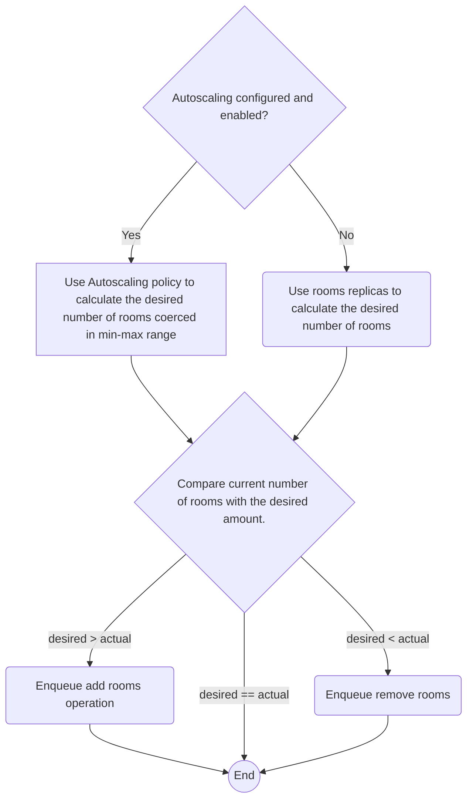

## What is
Autoscaling is an optional feature in which the user can choose and parametrize different autoscaling policies that maestro
will use to automatically scale the number of rooms in the scheduler.

Maestro has an internal process that periodically keeps checking if it needs to create or delete game rooms for the given scheduler,
if autoscaling is not configured or enabled, it will always try to maintain the current number of rooms equal to **roomsReplicas** scheduler property.
If autoscaling is configured **and** enabled, it will use the configured autoscaling policy to decide if it needs to **scale up** (create more rooms), 
**scale down** (delete rooms) or **do nothing**.



Currently, the sync interval is configured by environment variable `MAESTRO_WORKERS_OPERATIONEXECUTION_HEALTHCONTROLLERINTERVAL`.

> By default, the scheduler does not have autoscaling configured.

### How to configure and enable autoscaling
To get autoscaling working in your scheduler, firstly you need to configure an autoscaling policy and enable it, this autoscaling
configuration resides in the root of the scheduler structure itself.

Yaml version
```yaml
name: String
game: String
...
autoscaling:
  enabled: true
  min: 1
  max: 10
  policy:
    type: roomOccupancy
    parameters:
      ...
      // Will vary according to the policy type.
```

Json version
```json
{
  "name": "test",
  "game": "multiplayer",
  ...
  "autoscaling": {
    "enabled": true,
    "min": 10,
    "max": 300,
    "policy": {
      "type": "roomOccupancy",
      "parameters": {
        ...
        // Will vary according to the policy type.
      }
    }
  }
}
```

- **enabled** [boolean]: A value that can be true or false, indicating if the autoscaling feature is enabled/disabled for the given scheduler. Default: false.
- **min** [integer]: Minimum number of rooms the scheduler should have, it must be greater than zero. For zero value, disable autoscaling and set "roomsReplicas" to 0.
- **max** [integer]: Maximum number of rooms the scheduler can have. It must be greater than min, or can be -1 (to have no limit).
- **policy** [struct] : This field holds information regarding the autoscaling policy that will be used if the autoscaling feature is enabled:
  - **type** [string]:  Define the policy type that will be used, must be one of the [policy types maestro provides](#policy-types).
  - **parameters** [struct]: This field will contain arbitrary fields that will vary according to the chosen [policy type](#policy-types).


-------

## Policy Types
Maestro has a set of predefined policy types that can be used to configure the autoscaling, each policy will implement
a specific strategy for calculating the desired number of rooms and will have its configurable parameters.

### Room Occupancy Policy
The basic concept of this policy is to scale the scheduler up or down based on the actual room occupancy rate, by defining a "buffer" percentage
of ready rooms that Maestro must keep. The desired number of rooms will be given by the following formula:

`desiredNumberOfRooms = ⌈(numberOfOccupiedRooms/ (1- readyTarget) )⌉`

So basically Maestro will constantly try to maintain a certain percentage of rooms in **ready** state, by looking at the
actual room occupancy rate (number of rooms in **occupied** state).

#### Room Occupancy Policy Parameters
- **readyTarget** [float]: The percentage (in decimal value) of rooms that Maestro should try to keep in **ready** state, must be a value between 0.1 and 0.9.

#### Example

Yaml version
```yaml
autoscaling:
  enabled: true
  min: 1
  max: 10
  policy:
    type: roomOccupancy
    parameters:
      roomOccupancy:
        readyTarget: 0.5
```

Json version
```json
{
  "autoscaling": {
    "enabled": true,
    "min": 10,
    "max": 300,
    "policy": {
      "type": "roomOccupancy",
      "parameters": {
        "roomOccupancy": {
          "readyTarget": 0.5
        }
      }
    }
  }
}
```

Below are some simulated examples of how the room occupancy policy will behave:

> Note that the autoscaling decision will always be limited by the min-max values! .
> 
| totalNumberOfRooms | numberOfOccupiedRooms | readyTarget | desiredNumberOfRooms | autoscalingDecision |
|:------------------:|:---------------------:|:-----------:|:--------------------:|:-------------------:|
|         100        |           80          |     0.5     |          160         |    Scale Up: +60    |
|         100        |           50          |     0.5     |          100         |    Do Nothing: 0    |
|         100        |           30          |     0.5     |          60          |   Scale Down: -40   |
|         50         |           40          |     0.3     |          58          |    Scale Up: +8     |
|         50         |           35          |     0.3     |          50          |    Do Nothing: 0    |
|         50         |           10          |     0.3     |          15          |   Scale Down: -35   |
|         10         |           5           |     0.9     |          50          |    Scale Up: +40    |
|         10         |           1           |     0.9     |          10          |    Do Nothing: 0    |
|         10         |           1           |     0.8     |           5          |   Scale Down: -5    |
|          5         |           5           |     0.1     |           6          |    Scale Up: +1     |
|          1         |           1           |     0.3     |           2          |    Scale Up: +1     |
|          2         |           2           |     0.9     |          20          |    Scale Up: +18    |