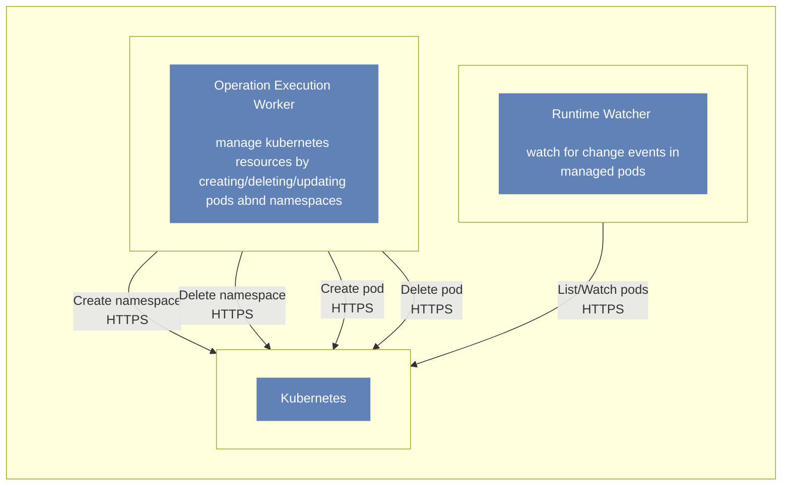

## Kubernetes usage
Maestro uses kubernetes for orchestrating game room instances. It uses a unique **namespace** for each scheduler, and a unique **pod** for each game room instance.

We use [client-go](https://github.com/kubernetes/client-go) for communicating with kubernetes. The [Runtime](internal/core/ports/runtime.go) port
is the interface used for managing resources, you can find all of the features we are using for managing k8s resources in it.

The diagram below shows how maestro components interact with kubernetes for managing resources.

### Runtime watcher
The runtime watcher component maintains a worker process for each scheduler that keeps watching and processing _change
events_ in pods resources. For doing that, it uses a [pods informer](https://pkg.go.dev/k8s.io/client-go/informers),
binding handlers for **add**, **update** and **delete** events for all pods managed by it.

This component is not responsible for updating/creating/deleting
kubernetes resources, all it does is to watch for changes and update its game room instances internal representation using redis.

### Operation execution worker
The worker uses kubernetes for managing pods and namespaces. It executes several [operations](Operations.md) that, alongside other side effects, will need to create, update, and delete namespaces and pods.

> **⚠ Currently, maestro does not check for HostPort conflict while creating new rooms**
> 
>One important note regarding how maestro creates pods: each new requested game room instance will be assigned to a pseudo-random port to be used as **HostPort**.
>
> Maestro uses the scheduler **PortRange** to generate the pseudo-random port. Currently, maestro does not check for HostPort conflict while creating new rooms. The final address
of the game room will be composed of the **Node** address and the game room container assigned **HostPort**. That's the reason why
maestro needs access for reading the Node addresses.

## Configuring cluster access

Maestro needs the following permissions for managing resources in a kubernetes cluster:
- nodes: read (we need to use the node address to compose the game room address);
- pods: read, create, update, delete;
- namespace: read, create, update, delete.

Maestro provides two ways for configuring kubernetes cluster access.

### Using inCluster mode
Set `adapters.runtime.kubernetes.inCluster` config value to true or use its env var equivalent, the kubernetes client will be configured 
automatically using the same _service account_ of the maestro component running pod.

This mode is recommended to be used when running maestro components in the same cluster
in which the schedulers and rooms will be managed.

### Using kubeconfig mode
Populate `adapters.runtime.kubernetes.kubeconfig` and `adapters.runtime.kubernetes.masterUrl` configs or use its env var equivalent, the kubernetes client
will be configured using the provided kubeconfig file and master url.

