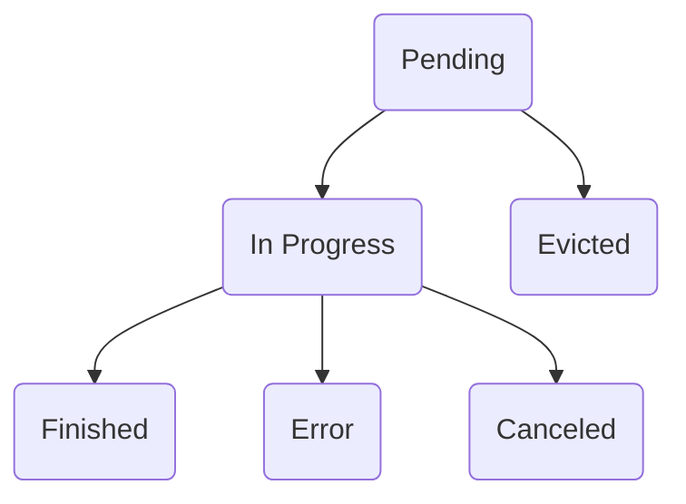
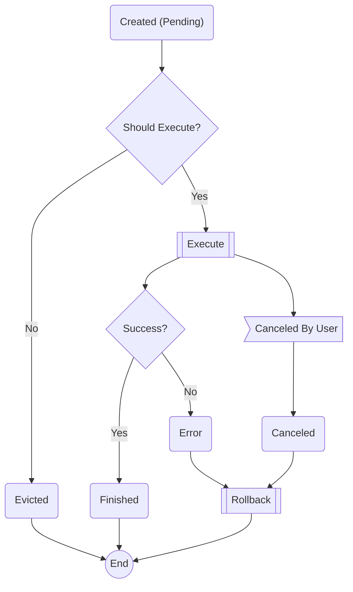
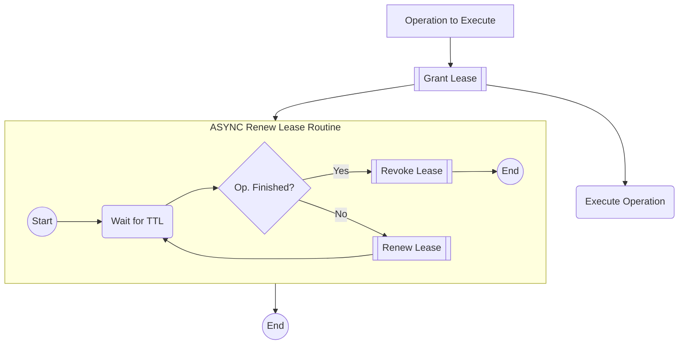

Table of Contents
---

- [What Is](#what-is)
  - [Definition and Executors](#definition-and-executors)
- [How does Maestro handle operations](#how-does-maestro-handle-operations)
- [States](#state)
  - [State Machine](#state-machine)
- [Lifecycle](#lifecycle)
- [Lease](#lease)
  - [What is](#what-is-the-operation-lease)
  - [Why operations have it](#why-operations-have-it)
  - [Troubleshooting operations with lease](#troubleshooting)
  - [Operation Lease Lifecycle](#operation-lease-lifecycle)
- [Available Operations](#available-operations)


## What is
Operation is a core concept at Maestro, and it represents executions done in multiple layers of Maestro, a state update, or a configuration change. 
Requests sent from game rooms are not handled in operations. Instead, the services directly take those. 
In most scenarios, those will be only state updates and won't perform any action on the scheduler or rooms.

Operations are heavily inspired by the [Command Design Pattern](https://en.wikipedia.org/wiki/Command_pattern)

### Definition and executors

Maestro will have multiple operations, and those will be set using pairs of definitions and executors.
An operation definition consists of the operation parameters.
An operation executor is where the actual operation logic is implemented, and it will receive as input its correlated definition.
So, for example, the `CreateSchedulerExecutor` will always receive a `CreateSchedulerDefinition`.

```
┌─────────────────────────────────┐
│ Operations                      │
│ ┌─────────────────────────────┐ │
│ │ Operation implementation    │ │
│ │                             │ │
│ │ ┌──────────┐   ┌──────────┐ │ │
│ │ │Definition│   │Executor  │ │ │
│ │ └──────────┘   └──────────┘ │ │
│ │                             │ │
│ └─────────────────────────────┘ │
│                                 │
│ ┌─────────────────────────────┐ │
│ │ Operation implementation    │ │
│ │                             │ │
│ │ ┌──────────┐   ┌──────────┐ │ │
│ │ │Definition│   │Executor  │ │ │
│ │ └──────────┘   └──────────┘ │ │
│ │                             │ │
│ └─────────────────────────────┘ │
│                                 │
│ ┌─────────────────────────────┐ │
│ │ Operation implementation    │ │
│ │                             │ │
│ │ ┌──────────┐   ┌──────────┐ │ │
│ │ │Definition│   │Executor  │ │ │
│ │ └──────────┘   └──────────┘ │ │
│ │                             │ │
│ └─────────────────────────────┘ │
│                              ...│
└─────────────────────────────────┘
```

## How does Maestro handle operations
- Each scheduler have 1 worker (no operations running in parallel for a scheduler).
- Every worker have 1 queue for operations.
- When the worker is ready to work on a new operation, it'll pop from the queue.
- The operation is executed by the worker following the lifecycle described [here](#lifecycle).

## State
An operation can have one of the Status below:
- Pending: When an operation is enqueued;
- Evicted: When an operation is unknown or should not be executed By Maestro;
- In Progress: Operation is currently active; 
- Finished: Operation finished; Execution succeeded;
- Error: Operation finished. Execution failed;
- Canceled: Operation was canceled by the user.
### State Machine


## Lifecycle


## Lease
### What is the operation lease
Lease is a mechanism to track operations execution and help troubleshooting long/delayed operations. 
### Why Operations have it
Sometimes, an operation might get stuck. It could happen, for example, if the worker crashes during the execution of an operation.
To keep track of operations, we assign each operation a Lease.
This Lease has a TTL (time to live). 

When the operation is being executed, this TTL is renewed each time the lease is about to expire but the operation is still in progress.
It'll be revoked once the operation is finished.

### Troubleshooting
If an operation is fetched and the TTL expired (the TTL is in the past), the operation probably got stuck.

If an operation does not have a Lease, it either did not start at all (should be on the queue) or is already finished. 
An Active Operation without a Lease is at an invalid state.


>**⚠ Maestro do not have a self-healing routine yet for expired operations.**


### Operation Lease Lifecycle


### Available Operations
For more details on how to use Maestro API, see [this section](https://topfreegames.github.io/maestro/OpenAPI/).
- **Create Scheduler**
  - Accessed through the `POST /schedulers` endpoint.
    - Creates the scheduler structure for receiving rooms; 
    - The scheduler structure is validated, but the game room is not;
    - If operation fails, rollback feature will delete anything created related to scheduler.
- **Create New Scheduler Version**
  - Accessed through the `POST /schedulers/:schedulerName` endpoint.
    - Creates a validation room (deleted right after).
    If Maestro cannot receive pings (not forwarded) from validation game room, operation fails;
    - When this operation finishes successfully, it enqueues the "Switch Active Version".
    - If operation fails rollback routine deletes anything (except for the operation) created related to new version.
- **Switch Active Version**
  - Accessed through `PUT /schedulers/:schedulerName` endpoint.
    - If it's a major change (anything under Scheduler.Spec changed), GRUs are switched using scheduler **maxSurge** property;
    - If it's a minor change (Scheduler.Spec haven't changed), GRUs are **not** switched;
- **Add Rooms**
  - Accessed through `POST /schedulers/:schedulerName/add-rooms` endpoint.
    - If any room fail on creating, the operation fails and other rooms are deleted on rollback feature;
- **Remove Rooms**
  - Accessed through `POST /schedulers/:schedulerName/remove-rooms` endpoint.
    - Remove rooms based on amount;
    - Rollback routine does nothing.