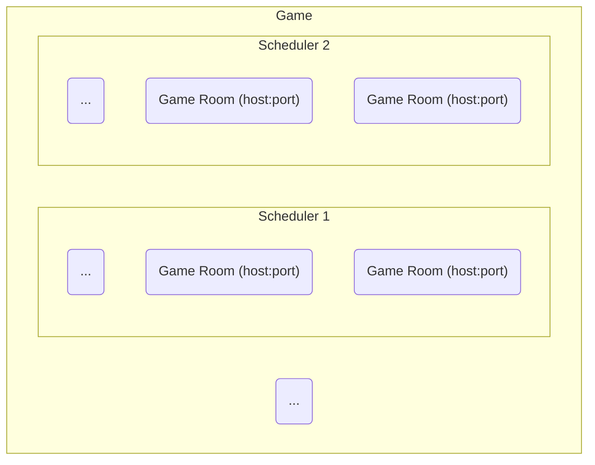

## What is
Objectively, a **Scheduler** is a recipe, and contains all the information for creating 
game rooms and forwarding rooms information to other services. 

Also, it's the **core entity** for operating game rooms in
Maestro, since all game rooms are related to a specific scheduler.

A game can have multiple schedulers, and each scheduler can have multiple game rooms up and running.


### How to Operate
To directly interact with a Scheduler, the user enqueues [operations](Operations.md) using the management API.

These operations are responsible for creating a scheduler or newer versions, switching an active version, adding/removing rooms, etc.

Because of that, everything that happens for a Scheduler can be tracked based on history of the operations executed for
that scheduler and the order they were executed.

### Versions
A Scheduler have versions, and each time we want to change scheduler properties, we end-up creating a new version to it.
> ⚠ Versions are directly calculated by Maestro, not sent by the client.
>
> The client can only switch the active version based on the versions created by Maestro. To switch to an specific version, see [this](Operations.md#available-operations).

This version can either be a Minor or a Major change.

- Major version: **Replace** the game rooms in a switch active version event.
  - Basically, any change under **spec**, that are related to the game room directly.
- Minor version: **Don't replace** game rooms in a switch active version event.
  - Info such as MaxSurge or forwarders, that do not impact the game rooms.

### Example
A complete Scheduler looks like this:

[comment]: <> (YAML scheduler)
<details>
    <summary>YAML</summary>
    <div class="highlight highlight-source-yaml position-relative overflow-auto">
        <pre>
name: scheduler-test
game: game-test
state: creating
portRange:
  start: 40000
  end: 60000
maxSurge: 30%
spec:
  terminationGracePeriod: '100'
  containers:
    - name: alpine
      image: alpine
      imagePullPolicy: IfNotPresent
      command:
        - /bin/sh
        - '-c'
        - >-
          apk add curl && while true; do curl --request POST
          {{maestro-rooms-api}}/scheduler/$MAESTRO_SCHEDULER_NAME/rooms/$MAESTRO_ROOM_ID/ping
          --data-raw '{"status": "ready","timestamp": "12312312313"}' && sleep
          1; done
      environment:
        - name: env-var-name
          value: env-var-value
        - name: env-var-field-ref
          valueFrom:
            fieldRef:
              fieldPath: path
        - name: secret-var-name
          valueFrom:
            secretKeyRef:
              name: secret-name
              key: secret-key
      requests:
        memory: 20Mi
        cpu: 100m
      limits:
        memory: 200Mi
        cpu: 200m
      ports:
        - name: port-name
          protocol: tcp
          port: 12345
  toleration: maestro
  affinity: maestro-dedicated
forwarders:
  - name: test
    enable: true
    type: gRPC
    address: {{host}}
    options:
      timeout: '1000'
      metadata: {}
        </pre>
    </div>
</details>

[comment]: <> (JSON scheduler)
<details>
    <summary>JSON</summary>
    <pre>
{
    "name": "scheduler-test",
    "game": "game-test",
    "portRange": {
        "start": 40000,
        "end": 60000
    },
    "maxSurge": "30%",
    "spec": {
        "terminationGracePeriod": '100',
        "containers": [
            {
                "name": "alpine",
                "image": "alpine",
                "imagePullPolicy": "IfNotPresent",
                "command": [
                    "/bin/sh",
                    "-c",
                    "apk add curl && while true; do curl --request POST {{maestro-rooms-api}}/scheduler/$MAESTRO_SCHEDULER_NAME/rooms/$MAESTRO_ROOM_ID/ping --data-raw '{"status": "ready","timestamp": "12312312313"}' && sleep 1; done"
                ],
                "environment": [
                    {
                        "name": "env-var-name",
                        "value": env-var-value
                    },
                    {
                        "name": "env-var-field-ref",
                        "valueFrom": {
                            "fieldRef": {
                                "fieldPath": "path"
                            }
                        }
                    },
                    {
                        "name": "secret-var-name",
                        "valueFrom": {
                            "secretKeyRef": {
                                "name": "secret-name",
                                "key": "secret-key"
                            }
                        }
                    }
                ],
                "requests": {
                    "memory": "20Mi",
                    "cpu": "100m"
                },
                "limits": {
                    "memory": "200Mi",
                    "cpu": "200m"
                },
                "ports": [
                    {
                        "name": "port-name",
                        "protocol": "tcp",
                        "port": 12345,
                    }
                ]
            }
        ],
        "toleration": "maestro",
        "affinity": "maestro-dedicated"
    },
    "forwarders": [
        {
            "name": "test",
            "enable": true,
            "type": "gRPC",
            "address": "{{host}}",
            "options": {
                "timeout": '1000',
                "metadata": {}
            }
        }
    ]
}
    </pre>
</details>

-------

## Structure
The **scheduler** is represented as:
```yaml
name: String
game: String
createdAt: Timestamp
maxSurge: String | Integer
portRange: PortRange
forwarders: Forwarders
spec: Spec
```

- **Name**: Scheduler name. This name is unique and will be the same name used for the kubernetes namespace.
  It's offered by the user in the creation and cannot be changed in the future. It's used as an ID for the scheduler;
- **game**: Name of the game which will use the scheduler. The game is important since it's common to use multiple schedulers
  for a specific game. So you probably will want to fetch all the schedulers from a game;
- **createdAt**: Info about the scheduler creation time. Cannot be altered by the user;
- **maxSurge**: Value represented in percentage (%) or Integer. Offered by the user on the scheduler creation. Can be altered anytime.
  Used by Maestro to replace pods. Ex: If maxSurge = 3, the [Switch Active Version](Operations.md#switch-active-version) (Major change) operation will replace pods from 3 to 3;
- **portRange**: Range of ports that can be used by Maestro to create GRUs for the specified scheduler. Can be altered by the user anytime. More info [here](#portrange);
- **forwarders**: Maestro can pass ahead info sent by the game rooms, such as Ping (Ready, Occupied, Terminating...), player and rooms events.
  The receivers can be configured here. More info [here](#forwarders);
- **spec**: Specifications about the game rooms managed by the scheduler, such as containers and environment variables used by them, limits and images. More info [here](#spec).


### PortRange
The **PortRange** is used to select a random port for a GRU between **start** and **end**.
 
- PortRange cannot be null or empty

> ⚠ Check if the ports offered are **available** and **can be used**. 
> A firewall rule, for example, can affect the connection to the Game Room in the specific port.

It is represented as:
```yaml
start: Integer
end: Integer
```

### Forwarders
Forwarders are configured to pass ahead info offered by the game rooms to Maestro. 
More than one forwarder can be configured for a scheduler.

- Can be an empty list.

It is represented as:
```yaml
- name: String
  enable: Bool
  type: String
  address: String
  options:
    timeout: Integer
    metadata: Object
```
- **name**: Name of the forwarder. Used only for reference (visibility and recognition);
- **enable**: Toggle to easily enable/disable the forwarder;
- **type**: Type of the forwarder. Right now, only accepts **gRPC**;
- **address**: Address used by the scheduler to forward events. E.g. 'api.example.com:8080';
- **options**: Optional parameters.
    - **timeout**: Timeout value for an event to successfully be forwarded;
    - **metadata**: Object that can contain any useful information for the game team. Will be forwarded with the events from Maestro.

### Spec
Contains vital information about the game rooms. Be aware that the spec is the most related aspect of the scheduler interacting with the runtime. 
It might be important to understand the basics of kubernetes before deep diving into the Maestro scheduler itself.

- Cannot be empty or null.

It is represented as:
```yaml
terminationGracePeriod: Integer
containers: Containers
toleration: String
affinity: String
```
- **terminationGracePeriod**: Required integer value. Must be greater than 0. When a game room receives the signal to be deleted, it will take this value (in milliseconds) to be completely deleted;
- **containers**: Contain the information about the game room, such as the image and environment variables. This is a list since the game room can be compounded by
more than two containers;
- **toleration**: Kubernetes specific. Represents the toleration value for all GRUs on the scheduler. See [more](https://kubernetes.io/docs/concepts/scheduling-eviction/taint-and-toleration/);
- **affinity**: Kubernetes specific. Represents the affinity value for all GRUs on the scheduler. See [more](https://kubernetes.io/docs/tasks/configure-pod-container/assign-pods-nodes-using-node-affinity/).

#### Containers
Contain the information about the game room, such as the image and environment variables.

- Cannot be an empty list.

It is represented as:
```yaml
- name: String
  image: String
  imagePullPolicy: String
  command: Array<String>
  environment: EnvironemntVariables
  requests:
    memory: String
    cpu: String
  limits:
    memory: String
    cpu: String
  ports: Ports
```
- **name**: Name of the container, used only for reference and can be changed by the user anytime.
- **image**: Docker image to be used for the container. Represented as a link.
- **imagePullPolicy**: Kubernetes specific. See [here](https://kubernetes.io/docs/concepts/containers/images/#image-pull-policy) for reference.
- **command**: List of commands that should be executed by the image on execution. E.g. [here](#example).
- **environment**: List of environment variables. See [here](#environment-variables).
- **requests** and **limits**: Kubernetes specific. See [here](https://kubernetes.io/docs/concepts/configuration/manage-resources-containers/#requests-and-limits).
- **ports**: The list of ports your game server exposes. See [here](#ports).

#### Environment Variables
List of environment variables used by the GRU.

- Can be an empty list.

There are, now, 3 supported formats by Maestro:

- Simple name-value format.
[comment]: <> (With Name/Value)
<details>
    <summary>With Name/Value</summary>
    <div class="highlight highlight-source-yaml position-relative overflow-auto">
        <pre>
- name: String
  value: String</pre>
    </div>
</details>

- Exposing pod fields (kubernetes specific). See [here](https://kubernetes.io/docs/tasks/inject-data-application/environment-variable-expose-pod-information/#use-pod-fields-as-values-for-environment-variables).
[comment]: <> (With FieldRef/FieldPath)
<details>
    <summary>With FieldRef/FieldPath</summary>
    <div class="highlight highlight-source-yaml position-relative overflow-auto">
        <pre>
- name: String
  valueFrom:
    fieldRef:
      fieldPath: String</pre>
    </div>
</details>

- Secrets as environment variables (kubernetes specific). See [here](https://kubernetes.io/docs/concepts/configuration/secret/#using-secrets-as-environment-variables).
[comment]: <> (With Secret)
<details>
    <summary>With Secret</summary>
    <div class="highlight highlight-source-yaml position-relative overflow-auto">
        <pre>
- name: String
  valueFrom:
    secretKeyRef:
      name: String
      key: String</pre>
    </div>
</details>

#### Ports
The list of ports your game server exposes.

- Can be an empty list.

It is represented as:
```yaml
- name: String
  protocol: String
  port: Integer
```

- **name**: Name of the port. Facilitates on recognition;
- **protocol**: Port protocol. Can be UDP, TCP or SCTP.;
- **port**: The port exposed.