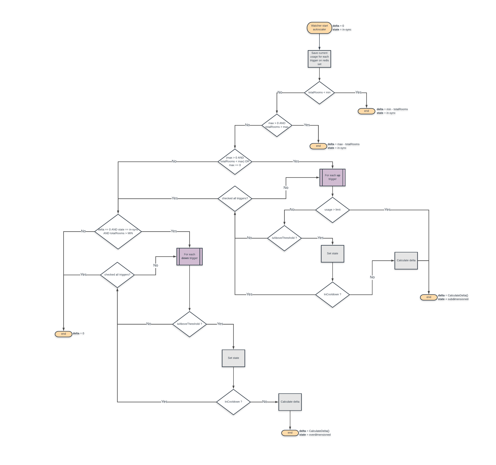

Autoscaling
========

There is an Autoscaler component in Maestro that starts with each watcher. It follows the scheduler autoscaling configuration present in the configuration YAML of each scheduler.

## Overview
Upscaling and downscaling are handled separately and each accepts a list of **triggers**.
These triggers contain all the configuration details that the watchers need to trigger autoscaling when necessary. 

The full autoscaling flow is represented below:


Notice that the order of the triggers in the lists is important as autoscaler will look until the first trigger that matches the actual conditions.

## Triggers
Each trigger is composed by the following elements:

1. [type](#type)
2. [usage](#usage)
3. [threshold](#threshold)
4. [time](#time)
5. [limit](#limit)

### type
Can be **room**, **cpu** or **mem** by default.
- **room**:
Scales using the percentage of rooms that are occupied. For upscaling, if more than x% rooms are occupied. For downscaling, if less than x% rooms are occupied.
In this case, the number of rooms to scale is given by the following formula:
```
roomsOccupied / ( totalRooms + delta ) = targetUsage / 100
delta = int( Round( (roomsOccupied * 100 - targetUsage * totalRooms) / targetUsage ) )
```

- **cpu** and **mem(memory)**:
Scales with the percentage of resources usage per pods. Resource usage is calculated using [kubernetes metrics api](https://github.com/kubernetes/metrics) to get raw usage values and [kubernetes client-go](https://github.com/kubernetes/client-go) to get containers requests values.
In this case, the number of rooms to scale is given by the following formula:
```
currentUsage = sum( PodsContainersResourceRawUsage ) / sum( PodsContainersResourceRequests )
usageRatio = currentUtilization / targetUsage
targetNumberOfRooms = int( ceil( usageRatio * totalRooms ) )
delta = targetNumberOfRooms - totalRooms
```

### usage
It is the target usage in percentage. It is different for up and downscaling and configured via scheduler YAML.

### threshold
When the watcher checks state, the autoscaler saves the current usage registered in a redis set. It is called point. For a scale to take place, a percentage of the total amount of points considered must be greater(up trigger) or less(down trigger) than the target usage specified. This percentage is defined by **threshold**.


### time
This is the duration of seconds to wait before triggering a scaling. 
```Time / ( watcher autoScalingPeriod )``` gives us the total amount of points that will be considered to define if a scaling need to take place.

### limit
It defines a percentage of usage that triggers scaling even if in cooldown period.

## Cooldown
It is the period to wait before running another scaling if it is needed. Cooldown is defined for both up and downscaling.

## Min and Max
These are hard caps for the total number of rooms (ready, occupied and creating) that can exist simultaneously. If Max is set to 0, it means that the scheduler can scale up indefinitely.

## Requests
Containers resources requests. It is required to define these values in order to use resource triggers(cpu and memory)

## Example autoscaling yaml config:

```yaml
...
requests:               
  memory: 1Gi              
  cpu: 1000m                
autoscaling:
  min: 100                  # minimum amount of GRUs
  max: 1000                 # maximum amount of GRUs
  up:
    metricsTrigger:         # Autoscaling respect the order of the triggers. The first that matches will autoscale
      - type: room          # can be room, cpu or memory
        threshold: 80       # percentage of the points that are above 'usage' needed to trigger scale up
        usage: 70           # minimum usage (percentage) that can trigger the scaling policy
        time: 600           # duration in seconds to wait before scaling policy takes place
     - type: mem            
        threshold: 80       
        usage: 70           
        time: 600           
    cooldown: 300           # duration in seconds to wait before consecutive scaling 
  down:
    metricsTrigger:
      - type: cpu
        threshold: 80       
        usage: 50           
        time: 900           
    cooldown: 300           
```

## Creating new autoscaler policies(types)
In order to implement a new autoscaler type, it is required to implement the autoscaler interface:
```go
type AutoScalingPolicy interface {
	CalculateDelta(trigger *models.ScalingPolicyMetricsTrigger, roomCount *models.RoomsStatusCount) int
	GetCurrentUtilization(roomCount *models.RoomsStatusCount) float32
}
```

You can find the policies on [autoscaler package directory](../autoscaler). Then add the new policy to the [autoscaler map of policies](../autoscaler/autoscaler.go) in the autoscaler instantiation function:
```go
func NewAutoScaler(schedulerName string, usageDataSource ...interface{}) *AutoScaler {
	return &AutoScaler{
		AutoScalingPoliciesMap: map[models.AutoScalingPolicyType]AutoScalingPolicy{

			// legacyPolicy
			models.LegacyAutoScalingPolicyType: newLegacyUsagePolicy(),

			// roomUsagePolicy
			models.RoomAutoScalingPolicyType: newRoomUsagePolicy(),

			// cpuUsagePolicy
			models.CPUAutoScalingPolicyType: newCPUUsagePolicy(
				usageDataSource[0].(kubernetes.Interface),
				usageDataSource[1].(metricsClient.Interface),
				schedulerName,
			),

			// memUsagePolicy
			models.MemAutoScalingPolicyType: newMemUsagePolicy(
				usageDataSource[0].(kubernetes.Interface),
				usageDataSource[1].(metricsClient.Interface),
				schedulerName,
      ),
      
      // newTypeUsagePolicy
			models.NewTypeAutoScalingPolicyType: newNewTypeUsagePolicy(
        // Optional dataSources
				usageDataSource[0].(kubernetes.Interface),
				usageDataSource[1].(metricsClient.Interface),
			),
		},
	}
}
```

And create the new type constant on [autoscaler model](../models/autoscaler.go):
```go
type AutoScalingPolicyType string

const (
	// LegacyAutoScalingPolicyType defines legacy usage autoscaling policy type
	LegacyAutoScalingPolicyType AutoScalingPolicyType = "legacy"
	// RoomAutoScalingPolicyType defines room usage autoscaling policy type
	RoomAutoScalingPolicyType AutoScalingPolicyType = "room"
	// CPUAutoScalingPolicyType defines CPU usage autoscaling policy type
	CPUAutoScalingPolicyType AutoScalingPolicyType = "cpu"
	// MemAutoScalingPolicyType defines memory usage autoscaling policy type
  MemAutoScalingPolicyType AutoScalingPolicyType = "mem"
  // NewType defines a new usage autoscaling policy type
	NewTypeAutoScalingPolicyType AutoScalingPolicyType = "newType"
)
```

After that, you can start using your new type on scheduler config:
```yaml
metricsTrigger:
  - type: newType
    threshold: 80       
    usage: 50          
    time: 900
    limit: 90           
cooldown: 300           
```