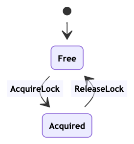
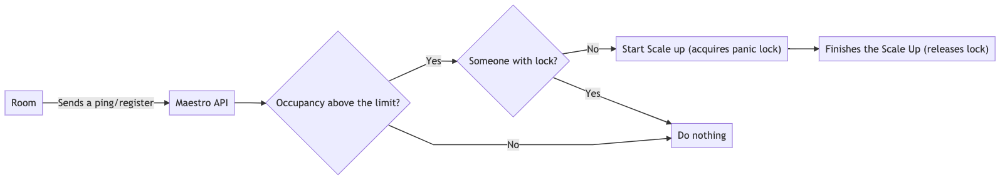

Locks
===========

As described in the [Overview](overview.md) page, Maestro schedulers may have
multiple watcher process taking care of them. Hence, when an operation is meant
to take place in a scheduler, these process can overlap and race conditions may
appear. Given that, Maestro implements locks, used by some operations to prevent
these conditions.

An operation that has locks usually checks to see if the lock is free: if not,
the operation does not proceed. When the lock is free, the first thing the
operation does it to acquire the lock, leaving it no longer free. In the end,
the operation is also responsible for releasing the lock, usually when
everything is done (including in error situations). The diagram below shows the
simple flow it follows.



Those locks are stored at Redis and exposed through
`/scheduler/{schedulerName}/locks` endpoint. The only exception is the panic
lock, which is not present on this API.

## Scheduler Config Lock

This lock is used to perform updates on scheduler configuration. All updates
acquire this lock, but they might be released at different moment:

1. If changes are related to the pod itself (like image and port changes),
   Maestro starts a replace on the pods to ensure that they're on the correct
   version and lock lasts until this replace operation is finished.
2. If changes don't affects the pods (like scaling configuration or
   permissions), the operation only consists of changing the scheduler in the
   database and the lock is released.

**NOTE**: Even if a scheduler update triggers a replace on the pods, this is
done asynchronous by the API itself, so the update request returning doesn't
mean that the lock should be already free.

Below, we present a pseudo-algorithm for understanding the lock flow. We name
the Scale, Scheduler Config and Downscale locks as SL, CL and DL, respectively.

```javascript
--- Acquire CL ---
  --- Acquire SL ---
    1 - load scheduler from database
    2 - check diff between new and old YAML
    3 - save new scheduler on database
  --- Release SL ---
  4 - if rolling update is not needed go to 9
  --- Acquire DL ---
    5 - divide current pods in chunks of size maxSurge (a percentage of current pods)
    *** Start goroutines ***
      6 - for each pod in chunk create a new pod and delete an old one
    *** End goroutines ***
    7 - if all chunks finished go to 9
    8 - if rolling times out or is canceled or error (when a pod fails to be created), do a rollback (start the flow again with old config)
  --- Release DL ---
  9 - update scheduler veersion status (deployed, canceled, error, ...) on database
--- Release CL ---
10 - end
```

## Downscaling Lock

This lock is for the scale down process and should happen only once at a time.
This process can happen in three scenarios:

1. When the worker (watcher) performs a RemoveDeadRooms and checks for rooms
   that does not have a desired state. It then chooses to remove those rooms and
   acquire the lock. This lock is only released when all the pods marked to be
   delete are gone or a timeout happen.

2. When the worker (watcher) performs a AutoScale and checks the delta and
   decides that it will perform a down scale, and it acquire the lock. This lock
   is only released when all the pods marked to be delete are gone or a timeout
   happen. (it uses the ScaleDown function)

3. When a scheduler scale (operation) is performed and it results in a
   downscaling, at this moment the lock is acquired. It performs a similar flow
   as the previous scenario, so it wait until all the pods to be gone or a
   timeout to happen to release the lock. (it uses the ScaleDown function)

**NOTE**: The task of acquiring and releasing the lock is not made at ScaleDown
function so actually in both scenarios mentioned this is performed in a
different way (but the results is the same).

**NOTE 2**: During down scaling at worker (triggered at AutoScale) it also has
the Termination (described later) lock. So on this case the process acquire and
releases both locks.

## Termination Lock

This locks was mainly thought to prevent any operation at pods to be performed
while the scheduler is being deleted. But it also works like a scale up lock
(when performed by the AutoScale). It happens in two cases:

1. When a scheduler will be deleted, it acquires the lock before starting and
   release when the deletion is complete;

2. At the worker (watcher) the AutoScale process runs with this lock, so any up
   scale or down scale has this lock also. The lock is released when AutoScale
   finishes.

NOTE: The scheduler scale when performing an up scale does not acquire the
termination lock, so it is possible to perform two up scales during the same
time (even three if we count the panic scale). 

## Panic Lock

This process is used during a "desperate time" where Maestro is seeing the
occupancy get above the limit defined by the scheduler, when this happens it
does a "panic scale" using the upscale delta. This check happens every time a
rooms sends its status to Maestro (ping and register), so in order to prevent
that multiple "panic scales" to happen it uses a lock. The "panic scale" flow is
described as below:


