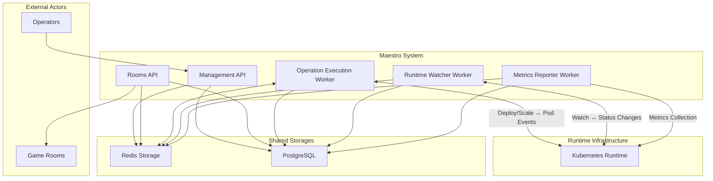
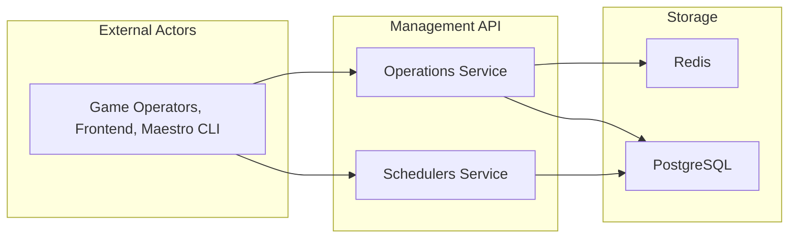
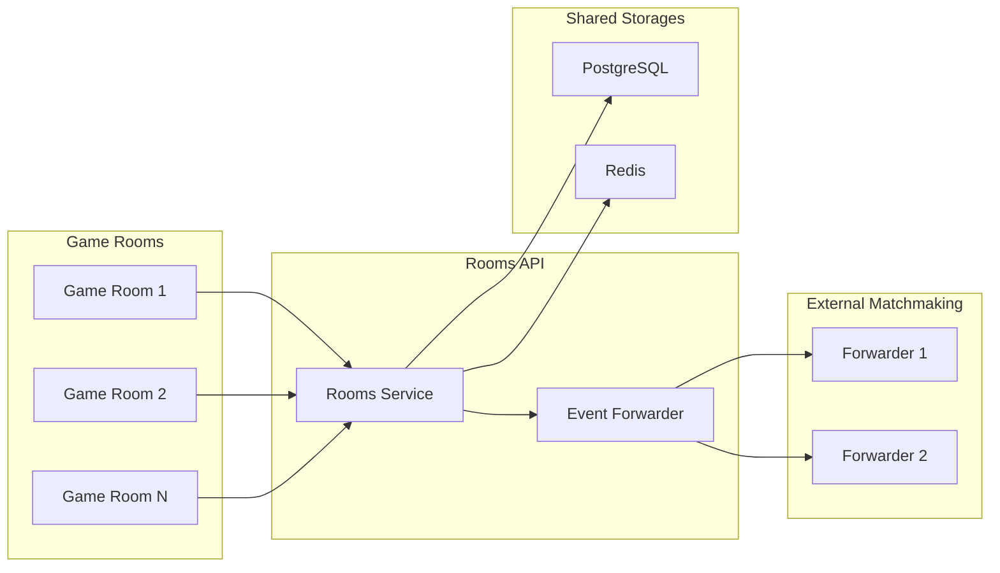
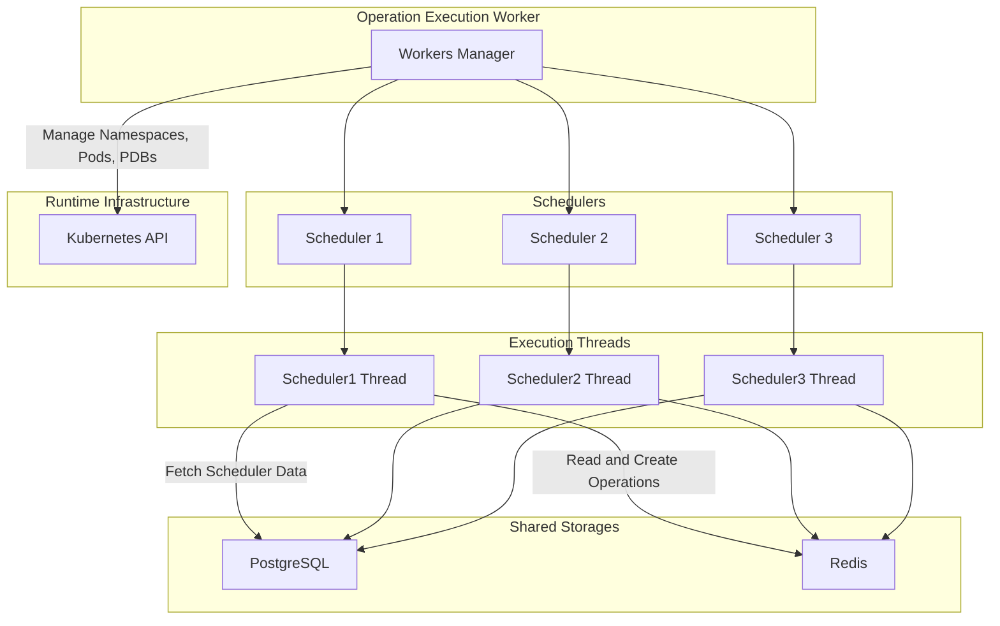
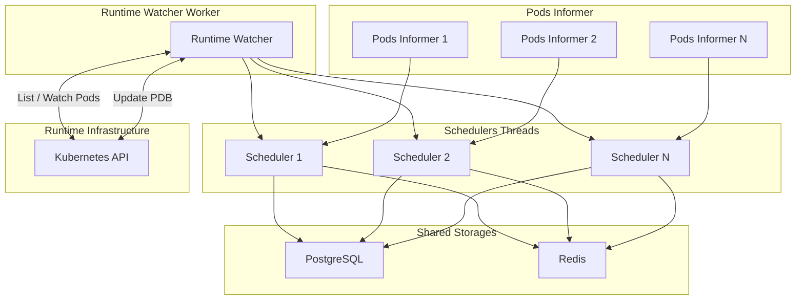
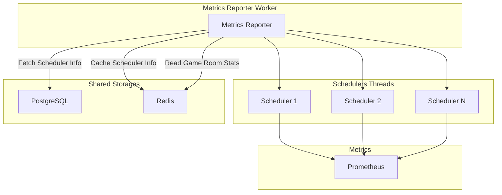

# System Patterns - Maestro Architecture

## Overview

Maestro Next is a modular system composed of different components that can be executed independently. All modules share the same codebase but are launched with specific command-line arguments: `go run main.go start [MODULE_NAME]`

## Core Architecture

## Module Components

### 1. Management API
**Purpose**: Primary interface for user requests and system management

**Key Responsibilities**:
- Accepts gRPC and HTTP requests
- Manages schedulers and operations
- Provides system-wide coordination

**Services**:
- **Schedulers Service**: Create, fetch, update schedulers
- **Operations Service**: Track and manage operation status

**Data Dependencies**:
- Redis: Operations and game rooms data
- PostgreSQL: Scheduler persistence

### 2. Rooms API
**Purpose**: Game room status synchronization and event forwarding

**Key Responsibilities**:
- Sync game room status with Maestro
- Forward events to configured destinations
- Maintain real-time room state

**Critical Notes**:
- **REQUIRED** for game rooms to function properly
- Must receive constant status updates from managed rooms
- Handles event forwarding for schedulers with forwarders configured

**Integration**:
- Uses [Maestro client](https://github.com/topfreegames/maestro-client) for easier integration
- Events protocol: [Proto file reference](https://github.com/topfreegames/protos/blob/master/maestro/grpc/protobuf/events.proto)

### 3. Operation Execution Worker
**Purpose**: Executes operations for active schedulers

**Key Concept**: Each worker manages operations for **one and only one Scheduler**

**Workflow**:
1. Monitors active schedulers
2. Creates execution threads per scheduler
3. Processes operations from scheduler queues
4. Tracks operation events and status

**Benefits**:
- Enables operation tracking
- Provides healthy scheduler changes
- Maintains execution isolation

### 4. Runtime Watcher Worker
**Purpose**: Monitors runtime events and reflects changes in Maestro

**Key Concept**: Each worker manages **one and only one Scheduler**

**Monitoring Capabilities**:
- Game room creation events
- Game room deletion events
- Game room update events
- Disruption mitigation based on occupied rooms

**Runtime Integration**: Currently supports Kubernetes only

### 5. Metrics Reporter Worker
**Purpose**: Reports runtime metrics and game room status

**Key Concept**: Each worker manages **one and only one Scheduler**

**Metrics Collected**:
- **Runtime Status**: `ready`, `pending`, `error`, `unknown`, `terminating`
- **Storage Status**: `ready`, `pending`, `error`, `occupied`, `terminating`, `unready`

**Important Note**: This module is **optional** - not required for core functionality

## System Constraints

### Runtime Support
- **Current**: Kubernetes only
- **Future**: Extensible to other runtime systems

### Worker Isolation
- Each worker operates on **one scheduler only**
- Prevents parallel execution conflicts
- Ensures clean operation tracking

### Data Flow Patterns
- **Redis**: High-frequency, temporary data (operations, room status)
- **PostgreSQL**: Persistent, structured data (schedulers)
- **Kubernetes**: Runtime state and orchestration

## Key Design Principles

1. **Modularity**: Each component has distinct responsibilities
2. **Isolation**: Workers operate independently per scheduler
3. **Observability**: Comprehensive operation tracking and metrics
4. **Scalability**: Horizontal scaling through worker instances
5. **Reliability**: Event-driven architecture with state persistence
