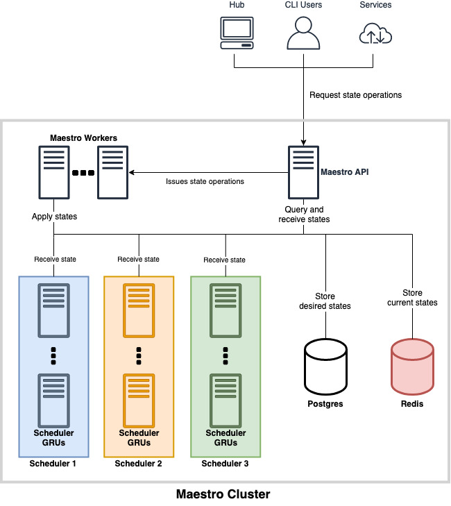

Overview
========

Maestro is a Kubernetes-native game server scheduler.

## Goal

Maestro goal is to provide an unified system that automatically scales game
rooms, regardless of the transport layer protocol (TCP, UDP). It's also
responsible for dealing with 

This system is related to a matchmaker but does not handle the specificities of
a match such as how many players fit in a room. It only deals with high level
room occupation, i.e. is the room occupied or available. The rooms communicate
directly with the matchmaker in order to register and
unregister themselves from the matchmaking.

## Ecosystem

The Maestro ecosystem is composed by:

- maestro: the service itself
- maestro-cli: a wrapper for the maestro-api endpoints
- maestro-client: a client lib for Unity and cocos2dx, responsible for calling
  maestro HTTP routes defined in the [room protocol](#room-protocol). It also
  must catch sigterm/sigkill and handle the room graceful shutdown.

In the future, we may have an UI for displaying metrics such as percentage of
rooms usage, room occupation rates and rooms resource metrics, like CPU and
memory.

## Definitions

Maestro uses some abstractions, based on Kubernetes resources, in order to
implement its service.

A **Game Room Unity (GRU)** is where the game server logic will run and clients
will connect to execute their matches. It's the most atomic entity in a Maestro
architecture.

One could define a GRU as a Kubernetes service (type nodePort) associated with a
single pod. This restriction is made because in AWS we cannot load balance UDP.
We're using containerized applications and Kubernetes in order to simplify the
management and scaling of the game rooms.

A **scheduler** is a specification for a set of GRUs. It defines the image,
variables, computing and networks resources, permissions and other
configurations for these GRUs. One can define them as a Kubernetes deployment
strongly attached to a namespace. This restriction is made because Maestro does
not allow more than one schedulers to be defined in the same namespace.

## Architecture

Here, we provide an overview of the service architecture. Maestro requires that
these entities, except Postgres and Redis, run in the same Kubernetes cluster.

The diagram below depicts the integration between services and we provide a
description of each component responsibility.



### API

The API is the connection of Maestro to the external world and with the GRUs
themselves. It talks HTTP and is responsible for:

- Receiving and processing client operation requests over schedulers;
- Listening to [GRU status](#room-protocol), through healthchecks;
- Storing scheduler desired states in Postgres.

### Postgres

Postgres is the storage for schedulers' desired state. They hold the actual
configuration a scheduler should have for their GRUs, keeping track of the
progress status of this configurations, its version and for what game they
should be applied. At the end, GRUs of a given scheduler should reflect the
state described at Postgres.

### Redis

Redis is responsible for caching the Kubernetes cluster state, obtained through
Kubernetes API. Hence, it reflects Maestro's schedulers current states,
preventing Maestro API and workers from flooding Kubernetes API.

Maestro API and workers would frequently consult this storage in order to
obtain schedulers state and checking if they are already matching the desired
state at Postgres. If they don't, they would perform operations in order to
reach these states and update Redis according.

### Worker

Workers implement the core logic of Maestro, being responsible of guaranteeing
that old states are deleted, new states are applied and scaling policies are
being followed.

As soon it starts, the worker obtain schedulers' states from Postgres and start
a **watcher process** for each scheduler. Through a loop, a worker will guarantee
that each scheduler will its own watcher process, creating new process for new
schedulers and keeping already created ones healthy.

Since workers are horizontally scaled, its possible a scheduler has more than
one watcher process managing it, across different workers. Given that, Maestro
implement locks, which are responsible for avoiding race conditions between
scheduler watcher process along distinct workers instances.

#### Watcher Process

The watcher process is instanced at each worker and is responsible for managing
a single scheduler. Through loops, it executes the following responsibilities:

1. **Update the scheduler GRU states at Redis.** It does that querying Maestro API,
   in a separate routine of its own;
   
2. **Guarantee that GRUs states are in sync with Postgres.** It does using the
   scheduler configuration version. Whenever GRUs are not using the desired
   version, the watcher executes routines to ensure that. Major versions changes
   trigger pods updates, while minor and patch version doesn't;

3. **Remove dead GRUs.** It does that by checking which GRUs are not signaling a
   healthy state between the configured healthcheck interval. Dead rooms are
   commanded to die and their data are cleaned from Redis.

4. **Execute auto scaling policies.** It does that by checking used resources
   and rooms over scheduler GRUs and deciding if upscales or downscales should
   be applied.

## Configuring Maestro

The maestro binary receives a list of config files and spawn one
maestro-controller for each config.

The config file must have the following information:

- Docker image
- Autoscaling policies
- Manifest yaml template
  1. Default configuration (ENV VARS)
  2. Ports and protocols (UDP, TCP)
  3. Resources requests (cpu and memory)


Example yaml config:

```yaml
name: pong-free-for-all     # this will be the name of the kubernetes namespace (it must be unique)
game: pong                  # several configs can refer to the same game
image: pong/pong:v123
affinity: node-affinity     # optional field: if set, rooms will be allocated preferentially to nodes with label "node-affinity": "true"
toleration: node-toleration # optional field: if set, rooms will also be allocated in nodes with this taint
occupiedTimeout: match-time # how much time a match has. If room stays with occupied status for longer than occupiedTimeout seconds, the room is deleted
ports:
  - containerPort: 5050     # port exposed in the container
    protocol: UDP           # supported protocols are TCP and UDP
    name: gamebinary        # name identifying the port (must be unique for a config)
  - containerPort: 8888
    protocol: TCP
    name: websocket
requests:                   # these will be the resources requests applied to the pods created in kubernetes
  memory: 1Gi               # they are used to calculate resource(cpu and memory) usage and trigger autoscaling when metrics triggers are defined
  cpu: 1000m                
limits:                     # these will be the resources limits applied to the pods created in kubernetes
  memory: "128Mi"           # they are used to decide how many rooms can run in each node
  cpu: "1"                  # more info: https://kubernetes.io/docs/tasks/configure-pod-container/assign-cpu-ram-container/
shutdownTimeout: 180        # duration in seconds the pod needs to terminate gracefully
autoscaling:
  min: 100                  # minimum amount of GRUs
  max: 1000                 # maximum amount of GRUs
  up:
    metricsTrigger:         # list of triggers that define the autoscaling behaviour
      - type: room          # the triggers can be of type room, cpu or memory
        threshold: 80       # percentage of the points that are above 'usage' needed to trigger scale up
        usage: 70           # minimum usage (percentage) that can trigger the scaling policy
        time: 600           # duration in seconds to wait before scaling policy takes place     
    cooldown: 300           # duration in seconds to wait before consecutive scaling
  down:
    metricsTrigger:
      - type: cpu
        threshold: 80       # percentage of the points that are above 'usage' needed to trigger scale down
        usage: 50           # maximum usage (percentage) the can trigger the scaling policy
        time: 900           # duration in seconds to wait before scaling policy takes place       
    cooldown: 300           # duration in seconds to wait before consecutive scaling
env:                        # environment variable to be passed on to the container
  - name: EXAMPLE_ENV_VAR
    value: examplevalue
  - name: ANOTHER_ENV_VAR
    value: anothervalue
cmd:                        # if the image can run with different arguments you can specify a cmd
  - "./room-binary"
  - "-serverType"
  - "6a8e136b-2dc1-417e-bbe8-0f0a2d2df431"
forwarders:                # optional field: if set events will be forwarded for the grpc matchmaking plugin
  grpc:
    matchmaking:
      enabled: true
      metadata:            # the forwarder metadata is forwarded in scheduler events (create and update)
        matchmakingScript: default
        metadata:
          authTimeout: 10000
        minimumNumberOfPlayers: 1
        numberOfTeams: 1
        playersPerTeam: 6
        roomType: "10"
        tags:
          score: score
```

A JSON file equivalent to the yaml above can also be used.


## Room Protocol

Game rooms have four different statuses:

  - **Creating**: from the time maestro starts creating the GRU in Kubernetes
    until a room ready is received. 
  - **Ready**: from the time room ready is called until a match started is
    received. It means the room is available for matches.
  - **Occupied**: from the time match started is called until a match ended is
    received. It means the room is not available for matches.
  - **Terminating**: from the time a sigkill/sigterm signal is received by the
    room until the GRU is no longer available in Kubernetes.

Maestro's auto scaling policies are based on the number of rooms that are in
ready state.
